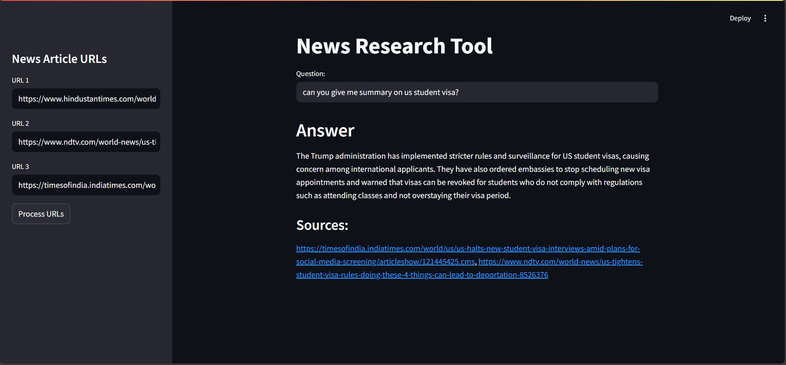

# 📰 News Research Tool

This Streamlit-based web app allows users to input news article URLs and ask questions about their content using **LangChain**, **FAISS**, and **OpenAI** APIs.

---

## 📂 Project Structure

```
gen_project_1/
│
├── .env                      # Stores your OpenAI API key
├── main.py                   # Streamlit app with LangChain integration
├── requirements.txt          # Python dependencies
├── notebook/                 # Contains notebooks and FAISS index
│   ├── faiss_index/          # Vector index files
│   ├── *.ipynb               # Jupyter notebooks for experiments
│   ├── *.csv, *.txt          # Sample data
└── .venv/                    # Virtual environment (excluded from Git)
```

---

## 🚀 Features

* Enter up to 3 news article URLs
* Extracts and splits text from URLs
* Embeds and stores document vectors using OpenAI Embeddings & FAISS
* Asks questions based on the documents
* Displays answers and sources using LangChain's `RetrievalQAWithSourcesChain`

---

## 🛠️ Setup Instructions

### 1. Clone the Repository

```bash
git clone https://github.com/kaushikandinakaran/News_Research_Tool.git
cd News_Research_Tool
```

### 2. Set Up a Virtual Environment

```bash
python -m venv .venv
source .venv/bin/activate  # On Windows: .venv\Scripts\activate
```

### 3. Install Requirements

```bash
pip install -r requirements.txt
```

### 4. Configure OpenAI Key

Create a `.env` file in the root directory with your OpenAI key:

```
OPENAI_API_KEY=your_openai_key_here
```

---

## ▶️ Run the App

```bash
streamlit run main.py
```

Then open the URL shown in the terminal (usually [http://localhost:8501](http://localhost:8501)) to interact with the app.

---

## 🧠 Tech Stack

* **Streamlit** – for building the user interface
* **LangChain** – for chaining LLM-based tools
* **FAISS** – for vector storage and retrieval
* **OpenAI Embeddings + GPT** – for semantic understanding and answering
* **Python-dotenv** – to manage API keys securely

---

## 📌 Notes

* Only URLs with accessible plain text or simple HTML structures work best.
* The FAISS index is saved locally in `faiss_store_openai`.
* Avoid uploading your `.env` and `.venv` folders to version control.

---

## 📷 Screenshot

 <!-- Replace with actual path -->

---

## 📄 License

MIT License 

